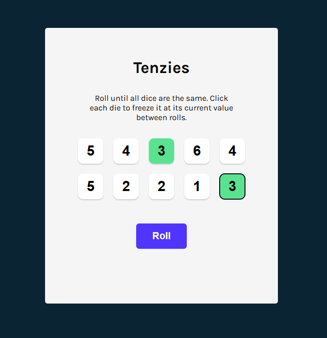
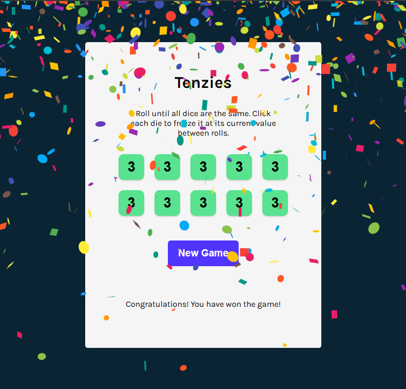

# Tenzies Game (made with React + TypeScript + Vite)

This is a game I developed as I was studying React via [Scrimba](https://scrimba.com/).

It is called Tenzies. The game begins with 10 dices (hence the name Tenzies). 

## How to play the game:

1. You roll the dice by pressing the *Roll* button below the dice.
2. You can hold a die by pressing that die. Holding a die will stop it from being rolled so it stays with the same face up.
3. As you roll the other dice, you hold the die/dices which match the other dice you already have held. Then you repeat this until all the dice are held with the same face up.

## About the game

This game is build using React, and with Vite as build tool.

Some of the React topics covered in this game are:

- JSX
- Fragments
- Props and State
- React hooks such as `useState`, `useEffect`, and `useRef`
- Parent/Child components interaction

Some front-end development (non-React) topics that were applied in this game are:
- Styling via CSS - The "Learn React" Scrimba lesson includes styling the game based on Figma specs.
- A11y - The lesson also includes challenges in making the game accessible via the keyboard and screen readers

### Screenshots

